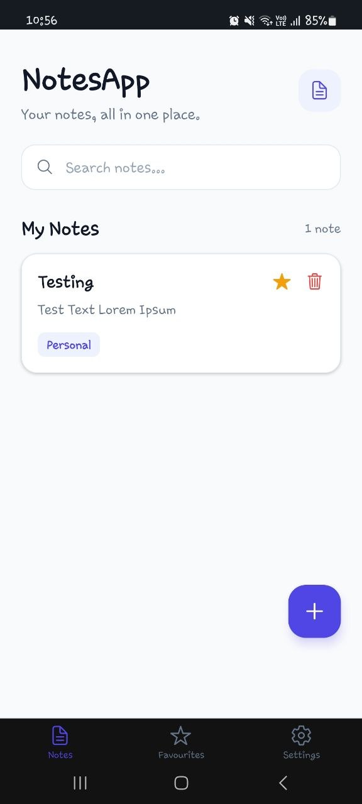
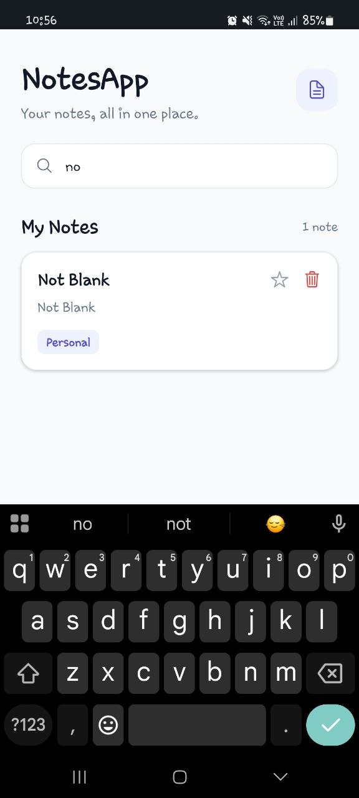
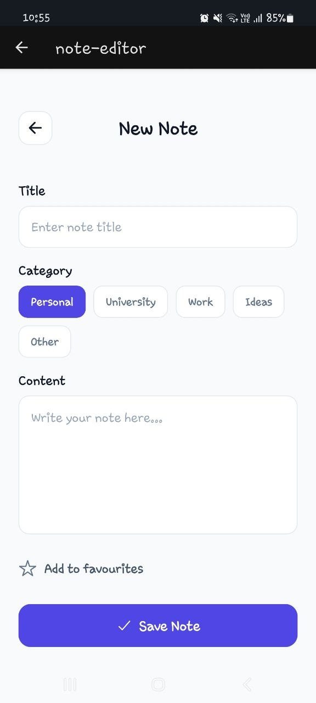
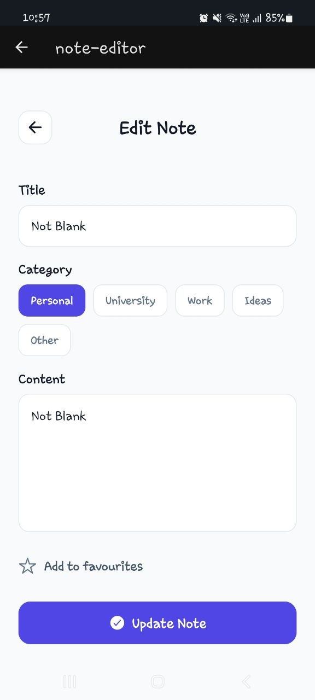
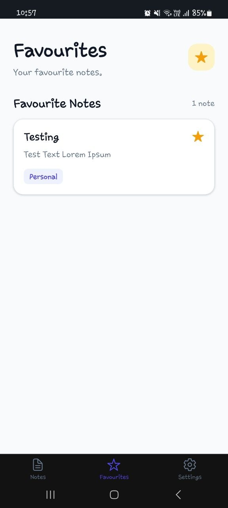
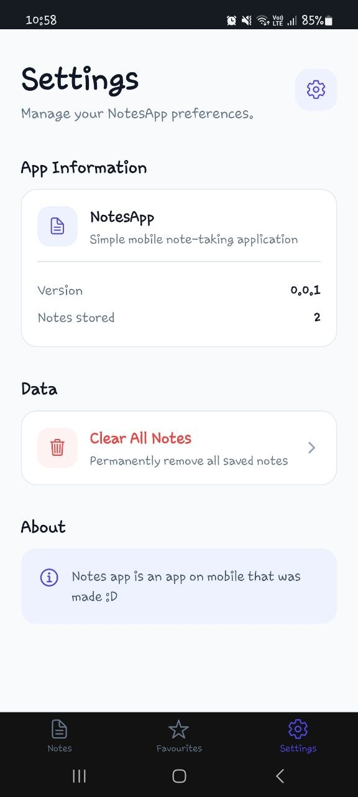
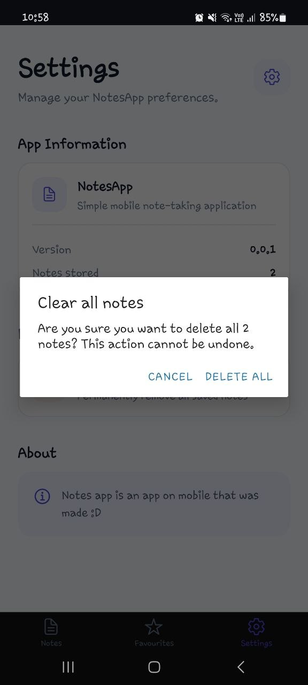
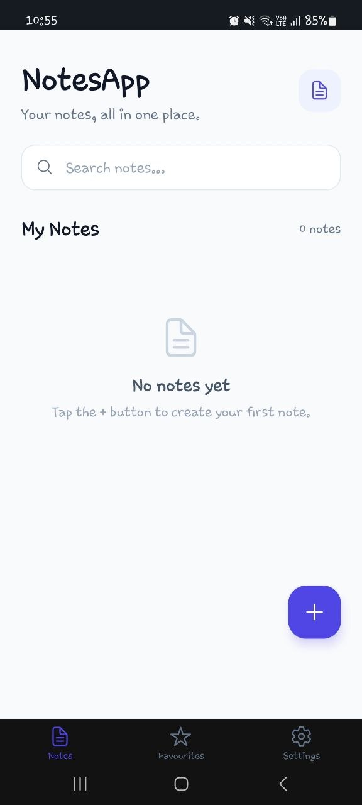

## Notes App
### By: Aishath Nuhza Masood | UWE ID: 24019755
https://github.com/naoyuumii/NotesApp

Notes App is a mobile applicztion that was developed using React Native and Expo. It allows the user to create, edit and delete notes. There are organizational features such as seaching and favouriting also included in this app and all of this data is stored locally on the device using AsyncStorage. 
---

## Installation & Run Instructions

### Prerequisites

Before running the application, make sure you have the following installed:

Node.js and npm
Expo Go on an Android or iOS device
A stable internet connection for installing dependencies and running the Expo development server

#### 1. Clone the Repository

Clone the project from GitHub:

git clone https://github.com/naoyuumii/NotesApp.git

Navigate into the project directory:

cd NotesApp

#### 2. Install Dependencies

Install all required project dependencies using npm:

npm install

#### 3. Start the Application

npx expo start

This will start the Expo development server and display a QR code in the terminal.

#### 4. Run on a Physical Device

Install Expo Go on your Android or iOS device.

Make sure your computer and mobile device are connected to the same network. Scan the QR code displayed by Expo to open the application in Expo Go.

## Features of the App

### Creating Notes
- Users can create notes by entering a title, content and category.
- Notes can also be marked as favourites when they are created.

### Editing  Notes
- Existing notes can be opened and edited. 
- Users can change the title, content, category and favourite status.

### Delete Notes
- Users can delete individual notes.
- Once user confirms the note will be deleted.

### Search
The search feature allows users to search notes by:
- Title
- Content
- Category

### Categories
Notes can be organised into:
- Personal
- University
- Work
- Ideas
- Other

### Favourites
- Users can mark notes as favourites and view their favourite notes from the Favourites screen.

### Persistent Storage
- Notes are stored locally using AsyncStorage. Notes, edits and favourite states remain available after restarting the application.

### State Management
- Zustand is used to manage the application's note state.

### Settings
The Settings screen provides:

- Application information
- Application version
- Number of stored notes
- Clear all notes functionality

### Validation
The application prevents users from saving notes without:
- A title
- Note content

### Empty State
- When no notes exist, the application displays an informative empty-state message.

---

## Screenshots

### Home / Notes

### Search

### New Note

### Edit Note

### Favourites

### Settings

### Delete Confirmation

### Empty State

## Technologies Used
- Expo Go
- React Native 
- Zustand
- AsyncStorage

## Further Improvements

Given more time I would implement a more robust notes app with more organisational features such as colour coding and grouping notes together. 

